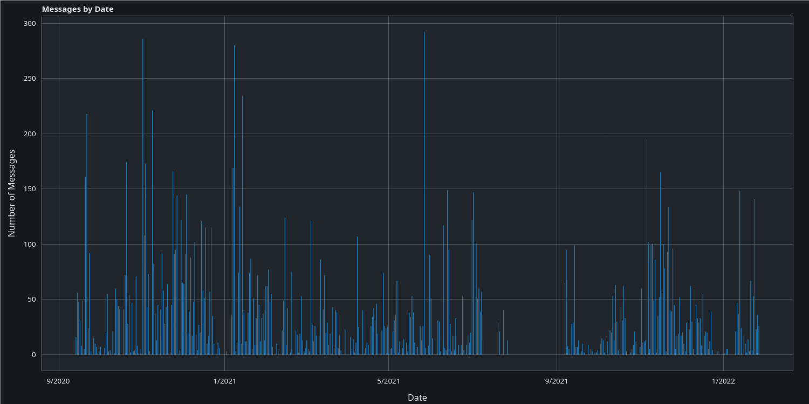

# Whatsapp Chat Data
Creates graphs from exported whatsapp chat data

## Usage (export chat from Android)

Click the 3 dots in the top right of the app

Select More

Use the Export Chat option

Export the chat without media, you can also include the media (images, videos, documents, ...), but they won't be used

Run the script using
    python3 main.py chat.txt
Pass the exported chat file (chat.txt) as argument
